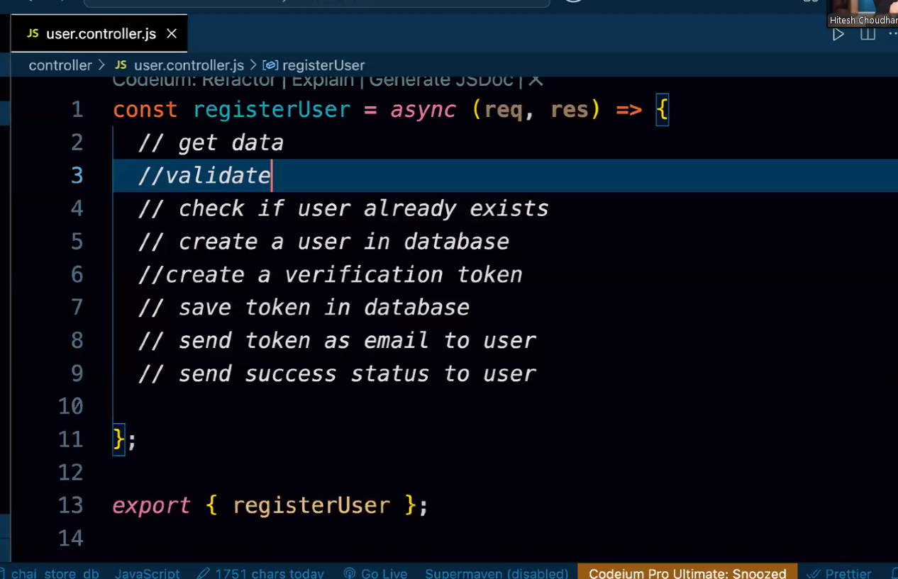

## What is the difference between require() and import statement

In ES6 modules, we can export and import values (functions, objects, variables, etc.) in different ways.

```js

const app = require('express')
import express from 'express'
```

You can't selectively load only the pieces you need with require but with import, you can selectively load only the pieces you need, which can save memory.

Loading is synchronous(step by step) for require on the other hand import can be asynchronous(without waiting for previous import) so it can perform a little better than require.

```js
// math.js
module.exports = {
    add: function (a, b) {
        return a + b;
    },
    subtract: function (a, b) {
        return a - b;
    },
};

// app.js
var math = require('./math.js'); // This imports the entire 'math' module not only the add or subtract function
console.log(math.add(1, 2)); // Using the add function from the module
console.log(math.subtract(5, 3)); // Using the subtract function from the module
```

```js
// utils.js
export function getDate() {
    return new Date();
}

export function getRandomNumber() {
    return Math.random();
}

// app.js
import { getDate } from './utils.js'; // Importing only the getDate function
console.log(getDate()); // Using the imported getDate function
```

# Differenct types of export:

### default export:

it allows us only single export from a module or there must be single default export in the module

```js
// utils.js
const getDate = () => {
    return new Date();
};
export default getDate; // Default export

// how to import default export
const getDate from "./utils.js"
```

### Named export:

it lets us to export multiple values(fn, var, obj) from the same module

```js
// utils.js
export const getDate = () => {
    return new Date();
};

export const getRandomNumber = () => {
    return Math.random();
};

export function greet(name) {
    return `Hello, ${name}!`;
}
// and to import named export we must use the curly braces{} eg
// app.js
import { getDate, greet } from './utils.js';  // Importing multiple named exports
console.log(getDate());  // Calls the getDate function
console.log(greet('Alice'));  // Calls the greet function

```

### Combining Default and Named Exports:
You can have both a default export and named exports in the same module.

```js
// utils.js
export const getDate = () => {
  return new Date();
};

export const getRandomNumber = () => {
  return Math.random();
};

const defaultGreeting = () => {
  return "Hello, world!";
};

export default defaultGreeting;  // Default export
// importing 
import defaultGreeting, { getDate, getRandomNumber } from './utils.js';
```
###  Importing All Exports Using * (Wildcard)
If you want to import everything from a module, you can use the * syntax. This imports the entire module as a single object, and you can access everything via that object.

```js
// utils.js
export const getDate = () => new Date();
export const getRandomNumber = () => Math.random();
export default function greet(name) {
  return `Hello, ${name}!`;
}

// app.js
import * as utils from './utils.js';  // Import everything as an object
console.log(utils.getDate());  // Calls the getDate function
console.log(utils.getRandomNumber());  // Calls the getRandomNumber function
console.log(utils.default('Alice'));  // Calls the default export (greet function)

```

or we can export like this:
```js
// utils.js
const test = "This is a test message";
const getDate = () => new Date();

export default {
  test,
  getDate,
};
// app.js
import myUtils from './utils.js';  // Importing the default export (object with test and getDate)

console.log(myUtils.test);  // Output: This is a test message
console.log(myUtils.getDate());  // Output: Current date and time

```